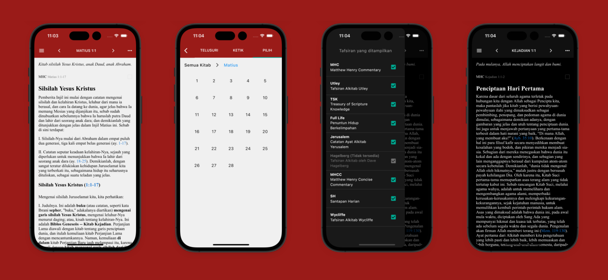

### :wave: Hey there! I'm a self-taught Flutter Developer with 1 year of experience in Flutter and more than 5 years of experience in mobile app development in general. Here's a bit of what I've been working on.

## Alkitab PEDIA

Alkitab PEDIA is an app developed by SABDA that introduces all of the books of the Bible from Genesis to Revelation. It highlights key elements of the literature, history, and various theological and analytical insights on every book and chapter in the Bible.

This app is currently in development. There are two different versions of the app for Android and iOS, but the iOS version is lacking some features. I'm contributing to bring these features and some more.

#### My Contributions
- Porting of Java code to Dart/Flutter
- Bible text integration (via SQL Database)
- Deep links
- Settings UI
- Dark mode
- Font scaling

##### :hammer:Technologies: Flutter SDK, SQL Database, HTML + CSS, Javascript

##### :rocket:Platform: :iphone:iOS

## Kamus Alkitab

Kamus Alkitab is a Bible dictionary app developed by SABDA. The app allows users to study thousands of biblical words and terms offline, making it convenient for users with limited internet access.

This app is currently exclusive to Android, and I'm working with them to bring the app to iOS while adding more features to it.

#### My Contributions
- Porting of Java & Kotlin code to Dart/Flutter
- Bible text integration (via SQL Database)
- Deep links
- Settings UI
- Dark mode
- Font scaling
- Search shortcut (via FAB)

##### :hammer:Technologies: Flutter SDK, SQL Database, HTML + CSS, Javascript

##### :rocket:Platform: :iphone:iOS

## Tafsiran Alkitab

Tafsiran is a Bible commentary app developed by SABDA. It provides a range of Bible commentaries from various authors for deeper study. It's a favorite app for many people who studies the Bible, having over 500,000 downloads on the Google Play Store.

This app is currently exclusive to Android, and I'm working with them to bring the app to iOS while adding more features to it.

### My Contributions
- Porting of Java code to Dart/Flutter
- Bible text integration (via SQL Database)
- Deep links
- Settings UI
- Dark mode
- Font scaling

##### :hammer:Technologies: Flutter SDK, SQL Database, HTML + CSS, Javascript

##### :rocket:Platform: :iphone:iOS

## Renungan PSM (Pagi, Siang, Malam)

Renungan PSM is a daily devotional app developed by SABDA. This app is designed to provide devotional readings for three times a day&mdash;in the morning, at noon, and in the evening.

The app hasn't been updated since 2014, so they wanted to rebuild the app with a design refresh and an iOS version.

### My Contributions
- Porting of Java code to Dart/Flutter
- Bible text integration (via SQL Database)
- Deep links
- Updated UI (with Material 3)
- Dark mode
- Font scaling

##### :hammer:Technologies: Flutter SDK, SQL Database, HTML + CSS, Salsa20 encryption

##### :rocket:Platform: :iphone:Android, iOS

